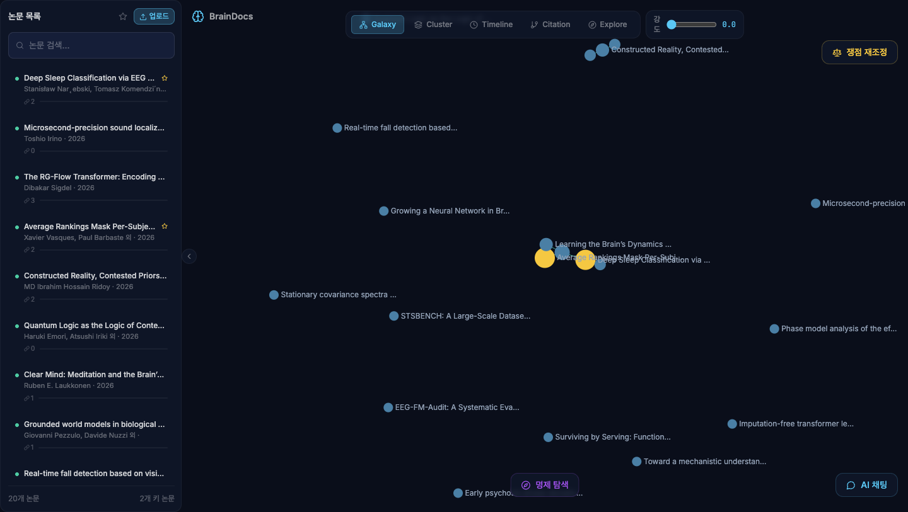
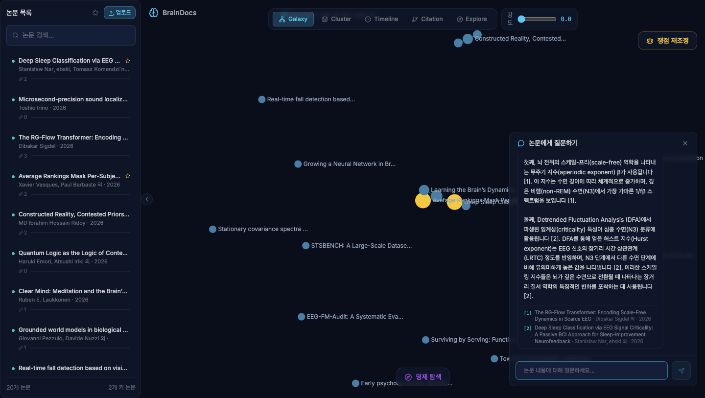
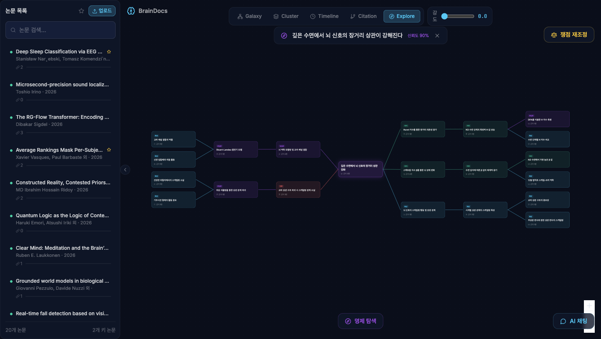
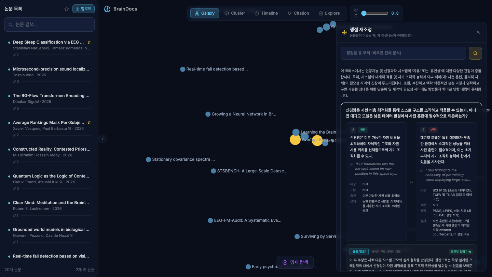

# BrainDocs

논문 PDF를 넣으면 파싱해서 지식 그래프와 벡터 인덱스로 색인하고, 질문하면 출처를 달아
답하는 도구입니다. 문헌 리뷰할 때 논문이 쌓이기만 하고 서로 어떻게 이어지는지는 결국
머릿속에만 있는 게 답답해서 만들었습니다.



## 뭘 할 수 있나

**출처 붙은 답변.** 워크스페이스에 올린 논문만 근거로 답합니다. 문장마다 `[1]` `[2]`가
붙고 아래에 어느 논문인지 나옵니다. 근거가 없으면 없다고 합니다.



**명제 탐색.** 명제를 하나 던지면 그걸 뒷받침하는 근거와 거기서 파생되는 결과를 논문에서
찾아 좌우로 뻗은 맵을 만듭니다. 노드를 누르면 어느 논문 어느 대목에서 나왔는지 보여줍니다.



**쟁점 재조정.** 이게 핵심입니다. 논문들이 서로 다른 소리를 할 때 *왜* 다른지를 봅니다.
단위를 논문이 아니라 주장(claim)으로 내리고, 각 주장에 방법론 지문(대상·표본·측정도구·설계)을
붙여서 비교합니다. 그러면 충돌이 단순히 측정 도구가 달라서인지, 표본이 달라서인지, 아니면
방법이 비슷한데도 결과가 반대인 진짜 쟁점인지 구분됩니다.



충돌 원인은 6가지로 분류합니다 — 측정 불일치 / 표본 차이 / 설계 차이 / 분석 차이 /
규모·조건 차이 / 실질적 상충. 심리학·사회과학 방법론 기준을 그대로 가져왔습니다.

## 왜 이렇게 만들었나

논문 도구는 이미 많습니다. 그런데 하는 일이 갈립니다.

- NotebookLM, SciSpace: 요약은 잘하는데 논문끼리 충돌하는 지점은 안 드러냅니다
- Connected Papers: 인용 위상만 보여주고 주장 내용은 모릅니다
- Scite: 인용문 감성은 분류하는데 방법론 차이는 모릅니다

문헌 리뷰에서 제일 오래 걸리는 게 "얘랑 쟤랑 결론이 다른데 이게 진짜 상충인가, 아니면
측정을 다르게 해서 그런가"를 가려내는 작업입니다. 그래서 이 부분을 자동화 대상으로 잡았습니다.

RAG도 그냥 벡터 검색만 쓰지 않고 그래프를 같이 씁니다. "A랑 연결된 개념 중에 B로 이어지는
게 뭐냐" 같은 멀티홉 질문은 벡터 유사도만으로는 안 잡히기 때문입니다.

## 구성

```
PDF 업로드 → Celery 워커
          → 파싱·청킹 (ingestion.py)
          → 임베딩 → Qdrant (embedding.py)
          → 개념·관계 추출 → Neo4j
          → 질의 시 Graph RAG로 검색 → 출처 붙여 생성 (rag_service.py)
```

프론트는 React + Vite, 그래프는 Sigma.js(WebGL), 명제 맵은 React Flow입니다.
백엔드는 FastAPI + Socket.io로 처리 진행률을 실시간으로 밀어줍니다.
저장소는 PostgreSQL(메타·청크) / Neo4j(그래프) / Qdrant(벡터) / Redis(큐)를 쓰고,
docker compose로 8개 컨테이너를 한 번에 띄웁니다.

LLM과 임베딩은 Gemini를 씁니다(`gemini-2.5-flash`, `gemini-embedding-001` 768차원).

## 실행

```bash
cp backend/.env.example backend/.env   # GEMINI_API_KEY 입력
docker compose up -d
```

- 프론트엔드 http://localhost:5173
- API 문서 http://localhost:8001/docs
- Neo4j 브라우저 http://localhost:7475

Neo4j가 늦게 뜨는 편이라 워커가 초기에 ServiceUnavailable을 뱉을 수 있습니다.
백엔드 startup에서 미완료 논문을 다시 큐에 넣도록 해뒀으니 그냥 두면 알아서 처리됩니다.

### 로컬 개발

```bash
# 백엔드
cd backend
python -m venv .venv && source .venv/bin/activate
pip install -r requirements.txt
uvicorn app.main:socket_app --reload --port 8000
celery -A app.workers.celery_app worker --loglevel=info   # 별도 터미널

# 프론트엔드
cd frontend && npm install && npm run dev
```

## 구조

```
braindocs/
├── backend/app/
│   ├── main.py                  FastAPI + Socket.io 진입점
│   ├── api/routes/              papers · graph · chat · explore · tensions
│   ├── services/
│   │   ├── ingestion.py         PDF 파싱 파이프라인
│   │   ├── embedding.py         임베딩 + Qdrant
│   │   ├── rag_service.py       Graph RAG 검색·생성, 명제 탐색
│   │   └── tension_service.py   쟁점 탐지 + 충돌 원인 분류
│   ├── repositories/neo4j_repo.py   Cypher 쿼리
│   └── workers/tasks.py         Celery 비동기 작업
└── frontend/src/components/
    ├── GraphView/               Sigma.js 그래프
    ├── PropositionExplorer/     React Flow 명제 맵
    ├── TensionPanel/            쟁점 재조정
    └── Chat/                    출처 인용 채팅
```

## 남은 것

- 업로드할 때 중복 논문을 안 걸러냅니다. 같은 논문을 두 번 올리면 그냥 두 번 들어갑니다
- 논문 간 유사도 엣지가 아직 단순합니다. 임베딩 기반으로 바꿀 예정
- DOI/arXiv ID로 메타데이터 자동으로 끌어오기 (CrossRef API)
- PDF 뷰어에서 인용 대목 하이라이트
- 클러스터 감지 (Leiden)

## 스택

Python · FastAPI · Celery · PostgreSQL · Neo4j · Qdrant · Redis · Docker Compose ·
React(Vite) · Sigma.js · React Flow · Gemini API
